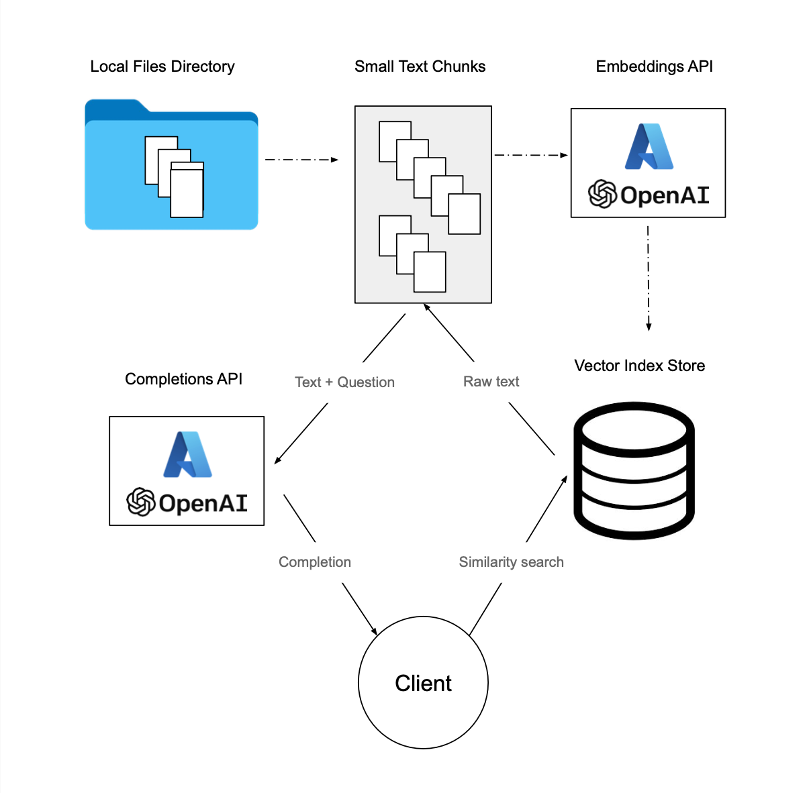

# Azure OpenAI Embedding

This repository utilizes Azure OpenAI Embedding service to answer questions and interact with your own documented data. 

## Prerequisites
You should have an Azure account and a running instance of OpenAI.

## Workflow



## Environment Setup

1. Clone the repository:

   ```
   git clone https://github.com/your-username/your-project.git
   ```

2. Create a Python environment:

   ```
   python -m venv .env
   ```

3. Activate the environment:

   ```
   source .env/bin/activate
   ```

4. Install the dependencies:

   ```
   pip install -r requirements.txt
   ```

5. Create environment variables for the API key and the Azure resource endpoint base.  
Select an instance on the [Cognitive Services Hub](https://portal.azure.com/#view/Microsoft_Azure_ProjectOxford/CognitiveServicesHub/~/OpenAI) and go to "Keys and Endpoints".  
Use either "KEY 1" or "KEY 2" and the "Endpoint" field.

   ```python
   export OPENAI_API_KEY=""
   export OPENAI_API_BASE=""
   ```

## Usage


```
python azure_openai.py
```

Prompt example:  
(Using data from the Wikipedia page [Coronation of Charles III and Camilla](https://en.wikipedia.org/wiki/Coronation_of_Charles_III_and_Camilla)).
```
Prompt: What was the venue of the coronation?
Completion: 
The venue of the coronation was Westminster Abbey.
Prompt: Were tiaras allowed at the ceremony?
Completion: 
No, tiaras were not allowed at the ceremony.
Prompt: What transportation did Charles and Camilla use to get to the abbey?   
Completion: 
Charles and Camilla used the Diamond Jubilee State Coach, drawn by six Windsor Greys, to travel from Buckingham Palace to Westminster Abbey.
```

